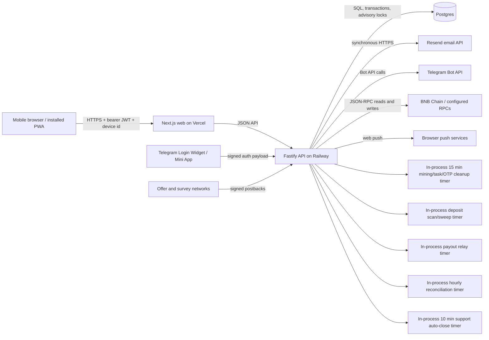

# Architecture and audit coverage

## Actual repository topology

The deployed design is two application services and one primary database. No Redis,
durable job queue, separate worker service, or scheduler is present in the repository.
Background work runs inside every API process and relies on database idempotency and,
for selected jobs, advisory locks.

## Trust boundaries

1. Browser/PWA to API: bearer tokens stored in browser local storage; all authorization
   must therefore be enforced by the API.
2. Telegram to API: signed Login Widget or Mini App payloads cross an untrusted browser.
3. Ad networks to webhook routes: network-specific signatures/tokens protect money credits.
4. API to database: ledger writes and money state transitions require transactions,
   idempotency, and concurrency control.
5. API to Resend, Telegram, push services, and chain RPCs: third-party availability,
   quotas, retry semantics, and response authenticity are external dependencies.
6. Staff browser to staff API: a stolen 30-day bearer token can reach operational and
   financial controls according to the database-backed role.

## Coverage achieved

| Area | Source inspection | Local exercise | Live/scale exercise | Final status |
|---|---:|---:|---:|---|
| Frontend routes and responsive PWA | Yes | Production build passed; lint passed with 7 image warnings | Browser tool could not initialize; no device journeys run | Exercised / blocked |
| API routes and authorization | Yes | 36 isolated scripts, 1,463 assertions, 0 failures | Active attack tests need an approved isolated target | Exercised |
| Postgres schema and ledgers | Yes | PGlite SQL/E2E coverage passed | Two real-Postgres race checks skipped; production metrics unavailable | Exercised / unverified |
| Email verification/reset | Yes | Audit auth probe exercised reset/session/fallback behavior | DNS, inbox delivery, account quota and webhook evidence unavailable | Exercised / blocked |
| Telegram authentication/linking | Yes | Signed-payload/linking E2E passed | Real Bot API limits and 429 behavior unavailable | Exercised / blocked |
| Withdrawals/deposits/disbursements | Yes | Sandbox E2E passed | Real chain/RPC/payout drills were not authorized | Exercised / blocked |
| In-process workers | Yes | Relevant unit/E2E paths passed | Restart, overlap, clock-skew and backlog drills need an isolated deployment | Exercised / blocked |
| Dependency/static security | Yes | Typecheck/build/lint and production dependency audits run | DAST needs an approved isolated deployed target | Exercised / blocked |
| 10k/100k active-user capacity | Yes | Workload model and k6 script supplied | No approved target or resource budget | Unverified |
| Monitoring, backup, rollback | Yes | Repository evidence only | Railway/Vercel/Resend dashboards and restore permissions unavailable | Inspected / blocked |

## Important topology consequences

- Every API replica has a separate ten-connection database pool and a separate in-memory
  rate limiter.
- Timers start in the API process. Scaling the API therefore also multiplies timer
  invocations; correctness depends on each job's database locks and idempotency.
- There is no general-purpose durable job queue for email, Telegram, push, or most
  time-based work. Selected money/chain workflows do persist relay and state records;
  other work can be lost when it has not already been represented in the database.
- The static `/health` response proves that the HTTP process is alive, but not that the
  database, provider integrations, or time-based workers are healthy.
